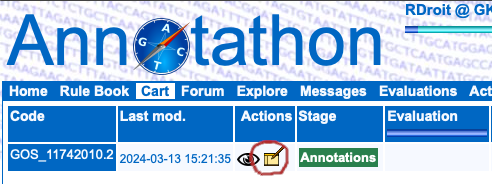
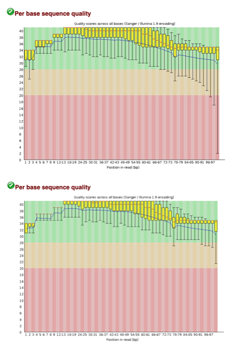

# Week 2 : sequence analysis {.unnumbered}

## Day 1: Annotathon! Identifying ORFs

The Annotathon project aims to give the students the opportunity to learn how to annotate unidentified sequences while helping the scientific community. In this course, the results you will produce will help progress on the discovery of new species or advance knowledge on known ones.

Each group will be affected an unknown sequence of DNA. Your mission, if you accept it, is to analyse this sequence and to gather the maximum of information you can on it.

Which means that there is no already known answer for the questions you will have. Each of you will follow the same bioinformatic process but the results will be uniq to the sequence.

### Getting ready

#### Creating an account

To create you account on https://annotathon.org/, clic on the "*New account*" tab

Follow the instructions to open a new account; make sure you select the appropriate Team


And the correct "**Team code**"

**GKBIOINFO2024**

You are required to enter at least one firstname/lastname pair, and one email address in order to receive Annotathon specific notifications. Your email address is secure and will under no circumstance be made public or passed on to any third party. Only low traffic messages specific to your course duration will be mailed to this address; no further messages will be sent after the course is completed.

Finally a clic on "**Open account**" should be followed by the message "**Account 'XYZ' has been created**". Use your 'username' and 'password' and clic "**Connect**" in the form at top of page to open an Annotathon session. You will be reminded that your email address is not validated until you have followed the special link included in an email automatically sent to you at account creation.

#### Reading the doc

To guide you for the Annotathon, you have the document you are reading right now that contains the main informations and guidelines. To go further in details, you can access a complete "**Rule Book**" directly on the website.


### Getting started

#### Getting the sequence

The first step is to get your sequence. To do that, go to "**Cart**", select the sample and clic "**Add a new sequence to your cart**".


You now have your sequence and should be on a page with a lot of informations about your sequence. (This is the new look of your "**Cart**" page)


- In this example, GOS_11742010.1 is the name of the sequence i am analysing.
- In the "**Actions**" section, the eye is to view the state of your annotation, the notebook is to change the annotation
- the "**version**" is to go back to a previous save of your annotation
- the "**Message**" section is to send messages to me in case you have questions
- "**Genomic Sequence**" is to get your actual sequence in a FASTA format
- ...

#### And now what ??

Well, now it is time to dive into the world of sequence annotation. You will follow a protocol described in the next chapter. For each step you will have to fill a report directly on the website. To start editing the report, clic on the notebook.



Every step of the analysis will be written following the same pattern :

Protocol :
Describe what tool is used, how it is used ...

-----------------------------------------
Results Analysis:
your observations

-----------------------------------------
Raw results:
output of the tool used

### Finding ORFs

Steps to find the Open Reading Frame (ORF)

#### copy your fasta sequence


go to : https://www.ncbi.nlm.nih.gov/orffinder/ 

Paste your sequence and choose the parameters (do not forget to note the selected parameters to your report).

For this study, you will only consider ORFs that verify the following criteria:

1. do not contain any **STOP codons** (basic ORF definition...)
2. contains at least **60 codons**
3. can be on either direct or reverse **strands**
4. can be in **frames 1, 2 or 3** on each strand
5. can be **complete or incomplete** at the 5' or 3' ends, or both!


Then clic on submit and you will have your first output for your sequence, congratulations !!


Now you can gather all of your ORFs sequences into your report (FASTA format) on the Annotathon website (only the ones that are more than 60 aa).


This should be your first entry to the annotathon report page, so it is time to talk about one really important thing here to avoid frustration : **REMEMBER TO SAVE YOUR WORK !!!!!!**
To do that, you clic on the "**save your annotations**" button on the top of the page.


Gather informations about all the ORFs in a table like this one :


then, make a representation of the ORFs on a schematic figure :


If you do have multiple ORFs, just arbitrary select the biggest one. If you want more details on this part, you can refer to the rule book, but here we will skip the classification of each ORF part.

You now have one ORF that you will annotate deeply, do remember to keep the sequence of the ORF on your report and to **save your work**.

### Conserved protein domains

Your new mission is now to find if your ORF contains any known domains (comparison to databases)
go to https://www.ebi.ac.uk/jdispatcher/pfa/iprscan5


Copy paste your sequence, keep all the databases selected, put a name for the run and clic on submit. After 2 - 5 minutes you will obtain your results. (you need to use the protein sequence here)

Then copy the raw output to your report and make a table with the informations as described here:


then analyse your results following the next guidelines :

**1. Selected domains** (if present)

    - Which domains predictions do you select to annotate the ORF? Specifiy their sizes, E-value! Justify your selection!
    - Refer clearly to Table 2 for your detailled analysis.

**2. Rejected domains** (if present)

    - Why are some functional domains rejected? (high E-value?  No IPR domains?)

Here you have to make choices based on the output of interproscan and other ressources you could find on the internet. Do remember to cite any exterior tool and also to **save your work**.

## Day 2: Annotathon! Alignments

### BLAST homolog search

BLAST is a well known tool to identify homologs of sequences. To use it, first go here :
https://blast.ncbi.nlm.nih.gov/Blast.cgi?PROGRAM=blastp&PAGE_TYPE=BlastSearch&LINK_LOC=blasthome
Here, since we already have the protein sequence we will use the BLASTp (protein BLAST).

The BLAST will be done twice, once against the NR database


and once against the swissprot database (just change the database in the yellow part). Remember to copy the raw results for both and to note the informations to create this table :


Then, using the raw results and this tool : https://annotathon.org/outils/blast_definition_list.php
create a definition list.


look at your list and merge the similar categories into a table in your results with this format :


Then, take time to discuss your analysis following those guidelines:

**RESULTS ANALYSIS**
Do not continue the analysis of the fragment if:

- No homologs (or very small number of homologs in NR database, ie <100)
- Your gene is already present in the NR biological database (nucleotide BLASTn with **ID > 95%**)

_**Proposed structure of your analysis section:**_

**1. Overview of the alignments**

- Synthetic description of your alignment results (number, known functions, quality of the alignments, ...)
- Give details on E-value range, % identity/similarity range, what about indels, alignment coverage, ....)

**2. Identification of protein homologs**

   - Justify E-value thresholds (NR & SP) (Evalue cutoffs, changes in putative homolog functions), refer to tables 3 & 4.

**3. Function of homologs from SWISSPROT analysis**

   - From SP entries, give details on closest homolog functions, specific role of important amino acids involved in catalytic function, cross your analysis with protein domain analysis. In all cases, cite your sources with web links.
   
### BLAST Taxonomic report

Using the output of your BLAST analysis you will now be able to construct a taxonomic report. To do that, go to this website https://annotathon.org/outils/blast_tax_report2.php , and copy your BLAST hits.


Hit the **Taxonomy Report** button. Copy the output to your report. Then, use this second tool : https://annotathon.org/outils/blast_taxonomy_list.php to produce a summary table.


hit the **Taxa table** button and you will get a summary table like this :


you can change the classification level parameter to have a more precise prediction

### Selecting sequences for multiple alignment

Now, using the previous results, you will create two groups of sequences :

- The study group (20 - 30 sequences) is composed with sequences of the same taxonomic group than your ORF and with a good E-value (the lowest possible).

- The external group (10 - 15 sequences) with the closest homologs outside of the taxonomic group of your ORF (Lowest e-value here too)

keep the amino acide sequences in a FASTA format.


## Day 3: Annotathon! Phylogenetic trees and conclusion

### Multiple alignments

Now that you have your list of sequences you can go to this website to do a multiple sequence alignment : http://www.phylogeny.fr/simple_phylogeny.cgi?workflow_id=b02e40313c3ca8c0e3d4dbc97db10078&tab_index=2

Copy paste your sequences here :

and clic submit.

The limitation in the number of sequences to align is simply due to computation time of multiple alignment programs, as well as subsequent phylogenetic tree reconstruction. Computation time is reasonable up to around thirty or fifty sequences of a few hundred residues.

Copy & paste the **"ClustalW" formated** multiple alignment in the '**Multiple Alignement**' Annotathon field.


**RESULTS ANALYSIS:**
**1. Quality of the multiple alignment**

   - Can you confirm that that sequences are really homologs? Similar lengths? How many identical positions? How many conservative substitutions positions? Number of indels? can you find that the conservation of sequences within alignment reflects the subgroups (In and out groups)? 
  - After curation with GBLOCKS, what is the number of conserved homolog positions (informative sites) for phylogenetic reconstruction? It is enough? 

**2. Identification of conserved blocks**

  - You can annotate well conserved blocks in your alignment with codes (such as A, B, C etc.) and refer to them in your analysis. 
  - Are there any conserved amino acids that are known as actives sites for this protein family? If yes, position in alignment, function, activity? 

**3. N and C-termini of the studied ORF**

   - Analysis of the N-ter/C-term of the alignment (complete? start codon? potentially missing number of amino acids in N and C-termini?)
   
### Phylogeny

To construct the phylogenic tree :
Use the previous multiple alignment to infer a phylogenetic tree using two distinct tree reconstruction approaches:

- 'distance' method (e.g. '**neighbor-joining (NJ)**', '**BioNJ**' or '**Phylip protdist/neighbor**')
- 'maximun likelyhood' method (e.g. '**PhyML)**')

Go to this place : http://www.phylogeny.fr/alacarte.cgi


Once you have the two versions for the report, you can play with the different parameters to see how the results are impacted.

Then use this tool : https://annotathon.org/outils/nw_utils.php
to create a tree to the format expected for your report. (copy the NEWICK format of your tree and paste it in the box)


Your result should look like this :


Copy & paste the **textual** tree representation in the '**Tree**' Annotathon field. Remember to include a protocol line in the '**Tree**' field that includes the program name and run parameters (ex 'Phylip / Protdist+neighbor / Randomized input - Random number seed = 11 / rooted on: Coccidioides immitis (ascomycetes)').

**Suggested plan for the analysis section:

**1. Tree topologies**

    - Describe the topology of each tree. What are the monophyletic groups?
    - Do the two independant trees describe the same evolutionary history? the same topology? Similar or different clades? 
    - Identify the commonalities as well as the potential incoherencies.

**2. Coherence with reference trees**

	- Are the in- and out-groups correctly separated?
	- Are your gene trees coherent with the reference species trees ("tree of life")? 
	- Identify each discrepancy with the reference species tree, and suggest some explanations (HGTs, gene duplications...).

**3. Predict the most likely taxonomic origin of the metagenomic ORF**

    - In which monophyletic clade does the the metagenomic sequence seem to emerge?
    - Propose a hypothetical taxonomic classification for the metagenomic ORF!
    - Provide detailed justification of your hypothesis, do not under/over interpret the infered phylogenetic trees!


After you have analysed the phylogenetic tree produced, specify the most likely taxonomic group (e.g. "Alphaproteobacteria") to which belongs the organism carrying your DNA fragment. To specify this group in the '**Taxonomy**' Annotathon field you have two options:

- specify in the '**NCBI numerical identifier**' box the taxonomic group code (for instance 204455 for _Rhodobacterales_, these codes are found in GENBANK records in the feature table, such as /db_xref="taxon:204455" or can be found by querying the NCBI taxonomy database using the link in the Help tab)
- specify the exact scientific name for this group in the '**Scientific name**' box (e.g. _Rhodobacterales_)


### Conclusion

Write up your interpretations and hypotheses based on the observations you have made in the preceeding "RESULTS ANALYSES". Imagine you are trying to convince a very sceptical colleague: use rigorous argumentation, cite precise evidence and numerical values when ever possible, highlight important findings, cross information from independent sources. Remember that in silico analyses generally do not constitute final proof, only suggestions. Terms such as "putative", "suggests" or "probably" can show understanding of the limitations of computational biology results.
Make sure you have at least covered:

-   arguments supporting your coding versus non-coding hypothesis; make sure you discuss the start position of your ORF (refer to the FAQ for all the subtlities and pitfalls)!
-   functionnal predictions for the protein, both at the biochemical level (e.g. "ubiquitin conjugation enzyme"), and the biological role at the organism level (e.g. "implicated in the control of the cell cycle"). Make careful use of annotations available for sequence homologs or conserved domains
-   your taxonomic classification hypothesis for the organism carrying this DNA fragment.

Some common pitfalls to avoid at all cost:

-   explain the theoretical aims and methodology of the tools used (please consider the readers knowledgable in these matters)
-   describe on which button you clicked (please consider that readers are highly familiar with running BLASTs)
-   write in telegraphic style
-   dilute, inflate, digress in the hope that evaluation is proportional to word volume
-   copy raw results in extenso in the discussion when the reader has direct access to them in the appropriate fields
-   write linearly without any structure, or purely chronologically
-   insulate the analyses from each other (you can, and certainly should, make reference to the multiple alignment while discussing the ORF boundaries)
-   conclude without references to the results and observations
-   propose hypotheses without providing the supporting evidence
-   make approximate statements, such as citing BLAST homologs or conserved domains without citing their respective E-values

Concentrate on producing a scientific, structured, synthetic and rigorous argumentation that will hold up to peer scrutiny!


## Day 4: Data formats and where to find them

Today we will go through commonly used tools and databases applied in genomic research. You will learn how to:

-   Identify common data formats and know how they are produced;\
-   Search and obtain genomic data from commonly used databases - GEO;\
-   Handle different data formats used for transcriptomics and epigenomics;\
-   Visualize genomic data in IGV.

### Meet IGV

Alongside the next sections, you will find some examples of files in IGV Viewer and you will use it in the exercises. Access it [here](https://igv.org/app/). We will work only with the Web app, but IGV provides a local software that is quite versatile too. 


Below this menu, you can select genome locations (in the format *chrN:start-end*) and search for genes. 

#### Example 1

Try IGV out using [this session](IGV_sessions/heart_Histones.json). Download the file, and upload it to IGV using Session > local file.

Do you recognize the differences between the different histone modifications? Blue represents active histone modifications (linked to active transcription). H3K27ac is a classical marker of active gene promoters and other open chromatin regions. H3K36me3 is linked with gene bodies.  

Conversely, red represents repressive histone modifications. H3K27me3 and H3K9me3 are both associated with repression/heterochromatin. However, H3K9me3 is meant to be much more permanent, while H3K27me3 is often associated with regions that can be activated in development.


> What genome assembly is being used?

> Inspect the HOXD gene cluster (Find it in *chr2:175,992,177-176,263,537*). Based on these signal tracks, do you think this cluster of genes is being expressed in heart?

> Check different genes (eg. BDP1, NPLOC4, PIK3C3) and observed the shape of the H3K27ac (activation) signal at their promoters. 

Using `Tracks > ENCODE Signals - other` look for the corresponding RNA-seq file (type RNA-seq heart in the search box, and look for the female patient with the right age...).
Check the expression of the previous genes. 

> Do you understand the RNA-seq profile along the genes?

### Identifying formats

Genomic data will generally fit into one of four classes:

-   Nucleotide sequences (like FASTQ);
-   Read alignments (like BAM files);
-   Annotations (as in GTF/GFF files);
-   Quantitative outputs (like count tables, peaks, among others).

Different formats and/or classes will be processed and visualised in different ways because they have distinct features.

Let us start with an example of a **FASTQ file**:

FASTQ files are text-based (as many other sequence classes) and are the **most common format for storage of sequences and quality scores from high-throughput sequencing technologies**. These are large files, so they are generally compressed (extension `.fastq.gz`). When opening a FASTQ file (using `zless` or `less` in the terminal), this what an entry will generally look like:

```         
@A00665:126:HTNC2DRXX:1:2101:1136:1047 1:N:0:AGGCAGAA+NTAAGGAG
GNCCTTACTAGACCAATGGGACTTAAACCCACAAACACTTAGTTAACAGCT
+
F#:FFFFFFFFF:FFFFFFFFFFFFFFFFFFFFF:FFFFFFFFFFFFF:FF
```

One FASTQ file contains millions of these entries. Each entry (starting with `@`) is composed of a sequence identifier (in this case, `@A00665:126:HTNC2DRXX ...`), the sequence itself, a separator (in this case, `+`), and the quality scores (Phred +33 encoded [check this page for further explanations](https://people.duke.edu/~ccc14/duke-hts-2018/bioinformatics/quality_scores.html)) for each base called. Sequence identifiers include information which allows us to know the name of the instrument which produced it, run identifiers, flowcell identifiers, pair number, index sequence, among others.

This example is from paired-end sequencing, meaning that there are two FASTQ files per sample and entries match between them. I.e., `@A00665:126:HTNC2DRXX` will also exist in FASTQ file 2. When the sequencing is single-end, only one FASTQ file is produced per sample.

Upon alignment to the reference genome, the FASTQ generates a BAM file. BAM files are compressed formats of SAM files (stands for **S**equence **A**lignment/**M**ap format), and they represent read alignments to a genomic location. SAM files are tabular-based and include header (which start with `@`) and alignment lines.


Alignment lines, corresponding to reads, will include different elements as shown above. One of the most important is the **flag**, which includes information on the alignment of a given read. The flag (in red) is just a number but it represents different combinations of read properties as you can see here [here](https://broadinstitute.github.io/picard/explain-flags.html). Flags can be used to remove unmapped read pairs or failing reads from further downstream processing.

> Check in the link above what would the flag 99, 512, and 13 mean in a SAM file.

Because these are large files, it is much more common to see read alignments in BAM format. However, BAM files are not human-readable as FASTQ is. You will visualize a BAM file later on in IGV. This is what it looks like:


While FASTQ and read alignment formats are generally common between different kinds of assays, the output after alignments depends on the assay. Let us explore different formats and to which assay they are associated to.

#### Where do different formats come from?


Assays meant to assess chromatin accessibility, transcription factors, or histone modifications are typically based in peaks, which are saved in a BED-like format. A BED file is structured as:

```
chr1	9922	10469	
chr1	564407	565441	
chr1	565595	567010	
chr1	2583259	2588018	
chr1	2627935	2629661	
```

In this example, each line is a detected peak at a given location in the genome (indicated as chromosome  start  end). Additional fields (like p-value, log fold change, length, among others) are often included but depend on the software that generated them. 


Chromatin accessibility, transcription factors, or histone modifications can also be represented in BigWig/bedGraph format. This formats, which look like summits, represent *signal*. Some assays require a control to distinguish this signal from noise (in ChIP-seq, this is usually refered to as Input). 

Let us see an example of BigWigs and peaks.

#### Example 2

Load the session [here](IGV_sessions/ExampleATAC_ChIP_CTCF_hg38.json) to see an example of how ChIP-seq and ATAC-seq correlate with each other. 

Observe how peaks (rectangles below the coverage tracks) are not always identified for all the "bumps" in the BigWig.

> Search for the ENCODE track for this cell line representing the H3K27ac signal (bigWig format!), and compare to ATAC-seq.

### A practical guide to GEO

[GEO](https://www.ncbi.nlm.nih.gov/gds/), standing for Gene Expression Omnibus is one of the most used repositories for microarray, next-generation sequencing, and other genomic datasets. When publishing a manuscript, authors must upload the sequencing data they produced into a public database to make it accessible to others, and GEO is often the chosen one. For this reason, GEO includes thousands of original submitter-supplied records that can be accessed from any place by anyone. 

We will learn how to search in GEO and how to read a GEO record to obtain specific information. 
Datasets in GEO can be found directly through a valid GEO accession number. 

#### Using filters and querying

Searching for datasets is not always easy because although some aspects of GEO are common, others are not. Submitters have freedom to adapt descriptions fitting to their specific submission and experiment, but that can make things harder when filtering for datasets.

You can see the global aspect of GEO search here:


The study section is one of the most important, as it indicates what kind of assay was performed and for which goal. For example, you would apply *Expression profiling ...* when looking for transcription data and *Genome binding/occupancy profiling ... * when looking for chromatin accessibility, histone modifications, or transcription factor data. In addition, you can also select the type of assay (*high throughput sequencing*, *array*, *Mass Spec*, ...). 

After this, you are ready to dive into a GEO record. Feel free to open one to see information inside. 

#### GEO records


Oftentimes it can be challenging to find the data you want in the format you need. While uploading data to GEO is a somewhat standardized procedure, looking for processed formats can be tricky. 

At the bottom of each GEO record, you can find the **Supplementary files**. This typically includes a collection (zipped) of all supplementary files (which you can access individually by selecting a single sample). 


##### Example 3

In this example, we will explore a GEO record and obtain information about data processing from it. 
Search for the dataset identified as **GSE205807**. 

> What cell line was this dataset generated from?

> What species and genome assembly is used for alignment?

> What kind of processed files are present in each sample?  


### EXERCISES

#### Exercise 1. Finding transcription factor targets using ChIP-seq

ChIP-seq can be used to identify genes regulated by targeted transcription factors. In the example, we will explore a dataset obtained in the human liver cell line HepG2.

1.1  Download the set of peaks for the FOS transcription factor from the GEO dataset GSE104247.

> What genome assembly is this dataset aligned to? Apply the necessary changes to see it in IGV. 

1.2. Load the dataset in the IGV web app. Give a couple of examples of genes that are likely regulated by FOS in this cell line.

1.3. Pick a set of peaks obtained in your favorite transcription factor from the same GEO dataset! How is the set of peaks you observed before comparable? 


##### Exercise 2. ATAC-seq and DNase-seq comparison

Load a track in BED and BigWig format from ATAC-seq and DNase-seq obtained in the same cell line using the *Tracks* section from *ENCODE Other* (BED) and *ENCODE Signals - Other* (Tip: There is typically plenty of material included for the A549 cell line). Compare the called peaks and other features from each experiment (peak size, noise, coverage) and discuss the advantages one has over the other.  


##### Exercise 3. Using GEO to look for DNA methylation datasets

3.1. What filters would you apply to look for a dataset of DNA methylation array which includes rhesus macaque (*Macaca mulatta*) and gorilla (*Gorilla gorilla*)? 

3.2. (optional) You want to find multiple transcriptomics datasets from *human tissues* infected with malaria parasites. What filters would you apply? 


##### Exercise 4. Going further

Let us see a different type of data - interaction data from ChIA-PET. Re-open the session [here](IGV_sessions/ExampleATAC_ChIP_CTCF_hg38.json) we used for example 2. Then, load a ChIA-PET *loop* track from A549 (genome-wide chromatin interactions mediated by *CTCF*) using **Tracks > ENCODE Other**. 

CTCF is an important element in genome organisation and ChIA-PET is an assay used to measure chromatin interactions mediated by specific factors.

Observe interactions at chromosomal and gene level. What can you conclude from the comparison between ATAC-seq, CTCF ChIP-seq, and ChIA-PET? 

> Is an interaction mediated by CTCF always associated with a CTCF peak? Why? 


## Day 5: RNA-seq - from FASTQ to count matrix

Today we will analyze the RNA sequencing data. Please refer to the intro section (`Where to start`) to log in the virtual machine.

After logging in, please check your current directory (`pwd`), and also please check your folder (`ls`). It should be empty for now.


### Connecting to the virtual machine

The tools that we will use today have already been preinstalled in a conda environment called `denbi`. You do not need to install them by yourself, but do remember to load them before using them.

- Follow the instructions in the Introduction (see left menu) to connect to the VM.
- In the terminal, type `conda activate denbi`


After loading the `denbi` environment, you are ready to go.

Just in case you have problems in signing the virtual machines, you can find the output files here: https://drive.google.com/drive/folders/1EJu2F_-pFvw4v71h1QJHq_xOcK6nMAKi?usp=drive_link

We will use the RNA-seq data from this paper: Nature volume 571, pages505–509 (2019). The raw sequence data is stored at: https://www.ebi.ac.uk/biostudies/arrayexpress/studies/E-MTAB-6798/sdrf

Two samples are taken. One from the 2 week post-conception (2WPC) mouse brain and the other from 4WPC brain.

You can find the raw data here: 
```{Raw data}
/vol/data/raw/mouse_brain_2wpb.fastq.gz


/vol/data/raw/mouse_brain_4wpb.fastq.gz
```

We will start with these `fastq` files, align them to the reference genome and quantify the gene expression. You can find the workflow below.


### Quality control

We retrieve the raw data and employ a software tool named `fastqc` to examine the quality of the sequence files.


We next examine the quality of the samples with `fastqc`. 

```{fastqc}
# Notice: only create folders/files under your own directoy. DO NOT create or delete anything outside your own directory.
mkdir path/to/your_fastqc_folder 

fastqc /vol/data/raw/mouse_brain_4wpb.fastq.gz -o path/to/your_fastqc_folder/

fastqc /vol/data/raw/mouse_brain_2wpb.fastq.gz -o path/to/your_fastqc_folder/

```

The start of the FastQC quality report provides basic statistics and an evaluation of various quality parameters.


> Question: What information do you get from the QC report?


In particular, we will look at the (1) per base quality, and (2) per sequence quality.





> Question: How does FastQC quantify the sequence quality?


> Question: What do you find when you compare the two sequences?


### Alignment

Alignment involves the process of mapping sequences to a reference genome. 

We use `Bowtie2` to implement seuqence alignment. Common aligners include `BWA`, `TOPHAT`, and `STAR`. They differ in their accuracy, speed, and memory usage due to different computational algorithms. 


```{}
# Notice: only create folders/files under your own directoy. DO NOT create or delete anything outside your own directory.

mkdir path/to/your_bam_folder


# Alignment (It will take for a while)
bowtie2 -p 2 --no-unal -x /vol/data/raw/chr6 -U /vol/data/raw/mouse_brain_2wpb.fastq.gz | samtools view -bS - > path/to/your_bam_folder/mouse_brain_2wpb_chr6.bam 
bowtie2 -p 2 --no-unal -x /vol/data/raw/chr6 -U /vol/data/raw/mouse_brain_4wpb.fastq.gz | samtools view -bS - > path/to/your_bam_folder/mouse_brain_4wpb_chr6.bam

```
> Question: How to view the BAM files? What do you find in your BAM files?
Ref: https://bookdown.org/content/24942ad6-9ed7-44e9-b214-1ea8ba9f0224/learning-the-bam-format.html
Hint: Use `samtools view` to view your BAM files.


We then use `samtools flagstat` to evaluate the quality of the aligned bam file.

```{flagstat}
# Notice: only create folders/files under your own directoy. DO NOT create or delete anything outside your own directory.
samtools flagstat path/to/your_bam_folder/mouse_brain_2wpb_chr6.bam  > path/to/your_bam_folder/mouse_brain_flagstat_2wpb_chr6.txt

```


### Quantification

Now, we utilise the BAM files to quantify the gene expression in our samples. We implement this with a tool named `htseq-count`. There are various methods exist for quantifying gene expression in `htseq-count`. For further illustration, please refer to the tutorial (https://htseq.readthedocs.io/en/release_0.11.1/count.html).

```{}
# Notice: only create folders/files under your own directoy. DO NOT create or delete anything outside your own directory.

mkdir path/to/your_count_folder
# Keep the high quality reads

samtools view -bq 40 path/to/your_bam_folder/mouse_brain_2wpb_chr6.bam > path/to/your_bam_folder/mouse_brain_2wpb_chr6_Q40.bam

htseq-count -s no -m intersection-nonempty --nonunique all --format bam path/to/your_bam_folder/mouse_brain_2wpb_chr6_Q40.bam /vol/data/raw/mm39.ncbiRefSeq.chr6.gtf > path/to/your_count_folder/mouse_brain_2wpb_chr6.txt

```

Please repeate the code above to get the count matrix from your mouse_brain_4wpb sample.


### Visualization

We will see what the bam files and count matrix files look like.

To view the bam files with IGV, we need an index file.

```{Visualization}
# Notice: only create folders/files under your own directoy. DO NOT create or delete anything outside your own directory.
cd  path/to/your_bam_folder

samtools sort mouse_brain_2wpb_chr6_Q40.bam -o mouse_brain_2wpb_chr6_Q40_sorted.bam # sort the bam

samtools index mouse_brain_2wpb_chr6_Q40_sorted.bam # index the sorted bam
```

To visualize the count matrix, you are encouraged to download the count matrix files to your local computer (using Cyberduck). Next, read the files in R, and visualize it (code below). 


```{Visualization}

library(tidyverse)
setwd("path/to/your_count_folder")


tb_2wpb <- read_tsv("mouse_brain_2wpb_chr6.txt", col_names = FALSE) %>% 
  rename(Gene = X1, Count = X2) %>% 
  mutate(Sample = "2wpb")

tb_4wpb <- read_tsv("mouse_brain_4wpb_chr6.txt", col_names = FALSE) %>% 
  rename(Gene = X1, Count = X2) %>%
  mutate(Sample = "4wpb")

tb_merge <- bind_rows(tb_2wpb, tb_4wpb)

tb_merge %>% ggplot(mapping = aes(x = log10(Count + 1), fill = Sample)) +
  geom_density(alpha = 0.2)


```


### Excercises

> 1. Please explore your bam files with IGV. What do you find ?(Hint: download both .bam and .bai file —>  open IGV browser —> click Genome > Mouse (GRCmm39mm39) —> click Tracks > Local Files >  select the two files -> select proper coordinate (e.g., chr6:28,527,661-28,527,699))

> 2. Please explore your count matrix of these two samples. Do you find any genes that express differentially between the samples? Also, think about that, if you are a project leader, how would you design your experiment and what hypothesis testing strategy would you opt for? (Note: Formal analysis will be revealed next week)

> 3. (Optional) Please try to run the whole workflow that you learnt today on mouse chromosome 8. The reference genome sequence can be found at /vol/data/raw. However, you are encouraged to retrieve the reference genome from the databases by yourself. 
